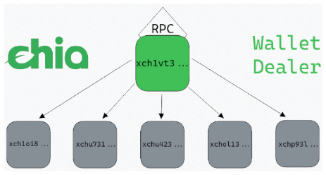

# Chia XCH Wallet Dealer



## Description
Welcome to Chia RPC XCH Wallet Dealer. The purpose of this project is fractionate and send XCH of an existing and synced chia wallet (using the Chia RPC Protocol) to multiple wallets destinations, using partitions rules on a config file.
Developed and tested only with the official [chia-blockchain](https://github.com/Chia-Network/chia-blockchain) project.

If you found the project useful, please consider a donation to my chia wallet :) 

`xch1vt3g694eclvcjmrj8mq83vtgrva9sw0qdz34muxrqjh5y5fzq6vq89n605`

## Requirements
Attending the official [chia RPC doc](https://docs.chia.net/docs/12rpcs/rpcs/) you need a wallet listening via RPC Protocol, built with a default installation.

You may also need Python interpreter (3.x) installed on your system and it is recommended to use pipenv for installing all libraries dependencys. You can install it with 

```bash
pip3 install pipenv
```

## Usage 
### The environment
* Install the environment with 

```bash
pipenv install
```

* Enter in the environment with 

```bash
pipenv shell
```

You can also execute xchdealer without entering in the environment, using `pipenv run python xchdealer.py [params]`, example:

```
pipenv run python xchdealer.py --help

usage: xchdealer.py [-h] -f CONFIG_FILE [-m {simulate,execute}]
...

```
### Edit the config
* Edit config_example.yaml to your needs and rename it if you want

## Config file
Example of config file:
```yaml
---
rpc_connector: 
  host: "localhost" #Host of the wallet
  port: 9256 #Port of the rpc wallet
  private_wallet_cert_path: "~/.chia/mainnet/config/ssl/wallet/private_wallet.crt" #Private certificate to connect with RPC
  private_wallet_key_path: "~/.chia/mainnet/config/ssl/wallet/private_wallet.key" #Key of the certificate to connect with RP
dealer:
  source_wallet:
    id: 1 #ID of source wallet, can be identified launching in simulate mode
    distribute_percentage_of_total: 100.0 #Percentage of all amount will be distributed, the rest keep on the wallet
    fee: 0 #Transaction fee, default 0
  destination_wallets:
    - name: "iv-vz" #For each destination specify a name
      address: "xch1vt3g694eclvcjmrj8mq83vtgrva9sw0qdz34muxrqjh5y5fzq6vq89n605" #Address of the destination wallet
      distribution_percentage: 90.0 #Percentage of total amount assigned to this wallet
    - name: "alber" 
      address: "xch1vt3g694eclvcjmrj8mq83vtgrva9sw0qdz34muxrqjh5y5fzq6vq89n605"
      distribution_percentage: 10.0

#The sum of all distribution_percentage of destination_wallets must be equal to 100.0
```

## Arguments

### Simulate mode

* You can execute xchdealer in simulate mode to show only the dealing results, check the config or identify the id of source wallet. Run:

```bash
python xchdealer.py -f config_example.yaml -m simulate
```

### Execute mode

* If you are sure of the result, you can execute the real transactions with:

```bash
python xchdealer.py -f config_example.yaml -m execute
```

